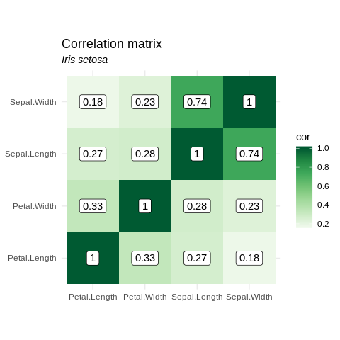
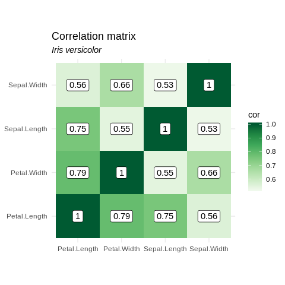
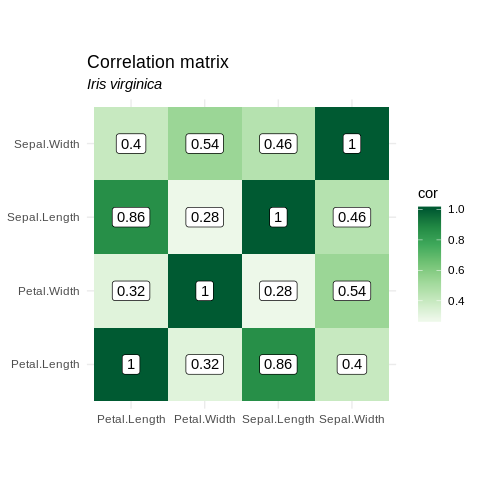

Analysis
================
Jean Manguy
26/06/2019

``` r
library(drake)
library(rrtoolsNdrake)
# print(getwd())
# r_make()
# plan <- create_plan()
# make(plan)
```

``` r
readd(cool_plot_setosa)
```

<!-- -->

``` r
readd(cool_plot_versicolor)
```

<!-- -->

``` r
readd(cool_plot_virginica)
```

<!-- -->
