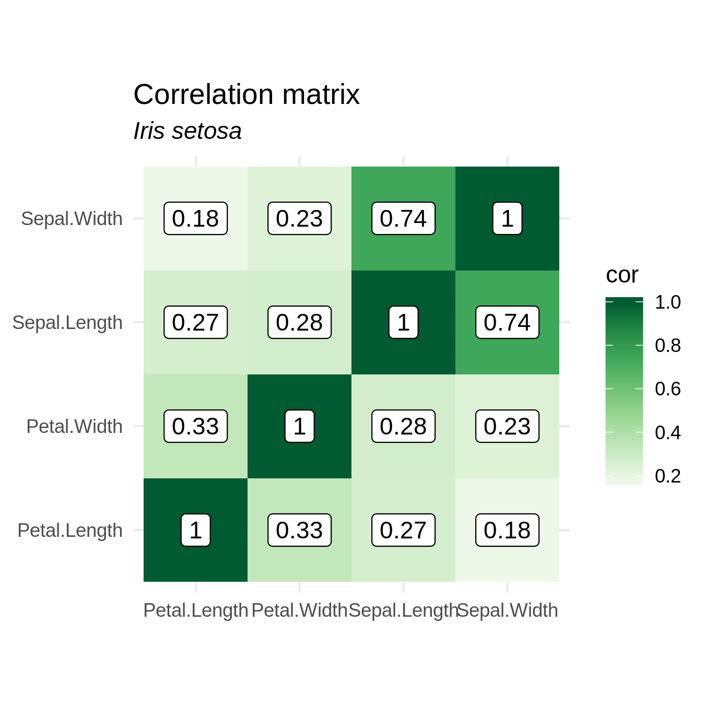

Analysis
================
Jean Manguy
26/06/2019

``` r
library(rrtoolsNdrake)
```

## Create plan

``` r
plan <- create_plan(output_dir = here::here("analysis/figures/"))
knitr::kable(plan)
```

| target                 | command                                                                                                                                                            |
| :--------------------- | :----------------------------------------------------------------------------------------------------------------------------------------------------------------- |
| my\_data               | load\_data()                                                                                                                                                       |
| statistics\_setosa     | compute\_statistics(my\_data, “setosa”)                                                                                                                            |
| statistics\_versicolor | compute\_statistics(my\_data, “versicolor”)                                                                                                                        |
| statistics\_virginica  | compute\_statistics(my\_data, “virginica”)                                                                                                                         |
| cool\_plot\_setosa     | make\_plot(statistics\_setosa, “setosa”)                                                                                                                           |
| cool\_plot\_versicolor | make\_plot(statistics\_versicolor, “versicolor”)                                                                                                                   |
| cool\_plot\_virginica  | make\_plot(statistics\_virginica, “virginica”)                                                                                                                     |
| save\_plot\_setosa     | ggsave(plot = cool\_plot\_setosa, filename = file\_out(“/home/jean/Documents/rrtoolsNdrake/analysis/figures/plot\_setosa.png”), width = 4.5, height = 4.5)         |
| save\_plot\_versicolor | ggsave(plot = cool\_plot\_versicolor, filename = file\_out(“/home/jean/Documents/rrtoolsNdrake/analysis/figures/plot\_versicolor.png”), width = 4.5, height = 4.5) |
| save\_plot\_virginica  | ggsave(plot = cool\_plot\_virginica, filename = file\_out(“/home/jean/Documents/rrtoolsNdrake/analysis/figures/plot\_virginica.png”), width = 4.5, height = 4.5)   |

## Run plan

``` r
drake::make(plan, packages = c("rrtoolsNdrake", "ggplot2"))
```

    ## target my_data

    ## target statistics_setosa

    ## target statistics_versicolor

    ## target statistics_virginica

    ## target cool_plot_setosa

    ## target cool_plot_versicolor

    ## target cool_plot_virginica

    ## target save_plot_setosa

    ## target save_plot_versicolor

    ## target save_plot_virginica

## Load ggplot2 objects and print them

``` r
readd(cool_plot_setosa)
```

<!-- -->

``` r
readd(cool_plot_versicolor)
```

<!-- -->

``` r
readd(cool_plot_virginica)
```

<!-- -->

## Or access directly the saved images

    


# Session info

``` r
sessioninfo::session_info()
```

    ## ─ Session info ──────────────────────────────────────────────────────────
    ##  setting  value                       
    ##  version  R version 3.6.0 (2019-04-26)
    ##  os       Linux Mint 19.1             
    ##  system   x86_64, linux-gnu           
    ##  ui       X11                         
    ##  language en_IE:en                    
    ##  collate  en_IE.UTF-8                 
    ##  ctype    en_IE.UTF-8                 
    ##  tz       Europe/Dublin               
    ##  date     2019-06-26                  
    ## 
    ## ─ Packages ──────────────────────────────────────────────────────────────
    ##  package       * version    date       lib source        
    ##  assertthat      0.2.1      2019-03-21 [1] CRAN (R 3.6.0)
    ##  backports       1.1.4      2019-04-10 [1] CRAN (R 3.6.0)
    ##  base64url       1.4        2018-05-14 [1] CRAN (R 3.6.0)
    ##  cli             1.1.0      2019-03-19 [1] CRAN (R 3.6.0)
    ##  colorspace      1.4-1      2019-03-18 [1] CRAN (R 3.6.0)
    ##  crayon          1.3.4      2017-09-16 [1] CRAN (R 3.6.0)
    ##  digest          0.6.19     2019-05-20 [1] CRAN (R 3.6.0)
    ##  dplyr           0.8.1      2019-05-14 [1] CRAN (R 3.6.0)
    ##  drake         * 7.4.0      2019-06-07 [1] CRAN (R 3.6.0)
    ##  evaluate        0.14       2019-05-28 [1] CRAN (R 3.6.0)
    ##  ggplot2       * 3.2.0      2019-06-16 [1] CRAN (R 3.6.0)
    ##  glue            1.3.1      2019-03-12 [1] CRAN (R 3.6.0)
    ##  gtable          0.3.0      2019-03-25 [1] CRAN (R 3.6.0)
    ##  here            0.1        2017-05-28 [1] CRAN (R 3.6.0)
    ##  highr           0.8        2019-03-20 [1] CRAN (R 3.6.0)
    ##  htmltools       0.3.6      2017-04-28 [1] CRAN (R 3.6.0)
    ##  igraph          1.2.4.1    2019-04-22 [1] CRAN (R 3.6.0)
    ##  knitr           1.23       2019-05-18 [1] CRAN (R 3.6.0)
    ##  labeling        0.3        2014-08-23 [1] CRAN (R 3.6.0)
    ##  lazyeval        0.2.2      2019-03-15 [1] CRAN (R 3.6.0)
    ##  magrittr        1.5        2014-11-22 [1] CRAN (R 3.6.0)
    ##  munsell         0.5.0      2018-06-12 [1] CRAN (R 3.6.0)
    ##  pillar          1.4.1      2019-05-28 [1] CRAN (R 3.6.0)
    ##  pkgconfig       2.0.2      2018-08-16 [1] CRAN (R 3.6.0)
    ##  purrr           0.3.2      2019-03-15 [1] CRAN (R 3.6.0)
    ##  R6              2.4.0      2019-02-14 [1] CRAN (R 3.6.0)
    ##  RColorBrewer    1.1-2      2014-12-07 [1] CRAN (R 3.6.0)
    ##  Rcpp            1.0.1      2019-03-17 [1] CRAN (R 3.6.0)
    ##  rlang           0.4.0      2019-06-25 [1] CRAN (R 3.6.0)
    ##  rmarkdown       1.13       2019-05-22 [1] CRAN (R 3.6.0)
    ##  rprojroot       1.3-2      2018-01-03 [1] CRAN (R 3.6.0)
    ##  rrtoolsNdrake * 0.0.0.9000 2019-06-26 [1] local         
    ##  scales          1.0.0      2018-08-09 [1] CRAN (R 3.6.0)
    ##  sessioninfo     1.1.1      2018-11-05 [1] CRAN (R 3.6.0)
    ##  storr           1.2.1      2018-10-18 [1] CRAN (R 3.6.0)
    ##  stringi         1.4.3      2019-03-12 [1] CRAN (R 3.6.0)
    ##  stringr         1.4.0      2019-02-10 [1] CRAN (R 3.6.0)
    ##  tibble          2.1.3      2019-06-06 [1] CRAN (R 3.6.0)
    ##  tidyr           0.8.3      2019-03-01 [1] CRAN (R 3.6.0)
    ##  tidyselect      0.2.5      2018-10-11 [1] CRAN (R 3.6.0)
    ##  withr           2.1.2      2018-03-15 [1] CRAN (R 3.6.0)
    ##  xfun            0.8        2019-06-25 [1] CRAN (R 3.6.0)
    ##  yaml            2.2.0      2018-07-25 [1] CRAN (R 3.6.0)
    ## 
    ## [1] /home/jean/R/x86_64-pc-linux-gnu-library/3.6
    ## [2] /usr/local/lib/R/site-library
    ## [3] /usr/lib/R/site-library
    ## [4] /usr/lib/R/library
