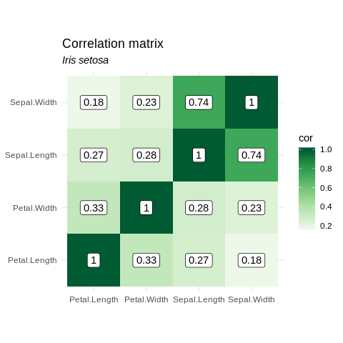

Analysis
================
Jean Manguy
26/06/2019

``` r
library(rrtoolsNdrake)
```

## Create plan

``` r
plan <- create_plan(output_dir = here::here("analysis/figures/"))
knitr::kable(plan)
```

| target                 | command                                                                                                                                                            |
| :--------------------- | :----------------------------------------------------------------------------------------------------------------------------------------------------------------- |
| my\_data               | load\_data()                                                                                                                                                       |
| statistics\_setosa     | compute\_statistics(my\_data, “setosa”)                                                                                                                            |
| statistics\_versicolor | compute\_statistics(my\_data, “versicolor”)                                                                                                                        |
| statistics\_virginica  | compute\_statistics(my\_data, “virginica”)                                                                                                                         |
| cool\_plot\_setosa     | make\_plot(statistics\_setosa, “setosa”)                                                                                                                           |
| cool\_plot\_versicolor | make\_plot(statistics\_versicolor, “versicolor”)                                                                                                                   |
| cool\_plot\_virginica  | make\_plot(statistics\_virginica, “virginica”)                                                                                                                     |
| save\_plot\_setosa     | ggsave(plot = cool\_plot\_setosa, filename = file\_out(“/home/jean/Documents/rrtoolsNdrake/analysis/figures/plot\_setosa.png”), width = 4.5, height = 4.5)         |
| save\_plot\_versicolor | ggsave(plot = cool\_plot\_versicolor, filename = file\_out(“/home/jean/Documents/rrtoolsNdrake/analysis/figures/plot\_versicolor.png”), width = 4.5, height = 4.5) |
| save\_plot\_virginica  | ggsave(plot = cool\_plot\_virginica, filename = file\_out(“/home/jean/Documents/rrtoolsNdrake/analysis/figures/plot\_virginica.png”), width = 4.5, height = 4.5)   |

## Run plan

``` r
drake::make(plan, packages = c("rrtoolsNdrake", "ggplot2"))
```

    ## All targets are already up to date.

## Load ggplot2 objects and print them

``` r
readd(cool_plot_setosa)
```

<!-- -->

``` r
readd(cool_plot_versicolor)
```

<!-- -->

``` r
readd(cool_plot_virginica)
```

<!-- -->

## Or access directly the saved images

    


